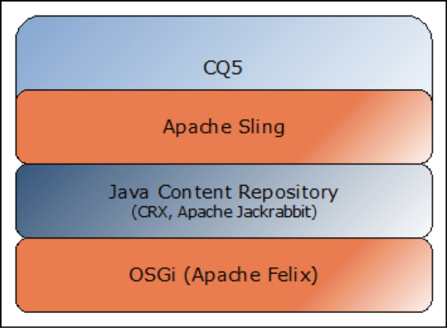
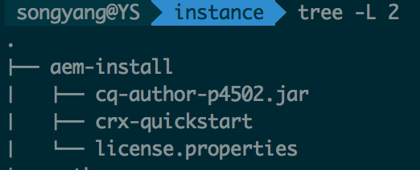

# AEM - Adobe CMS 扒坑记之始
AEM是Adobe公司所出的商业内容管理系统，全称**阿豆比体验管理系统**(Adobe Experience Manager)，其前身叫**CQ**，分别有` CQ5 ` ` CQ6 `两个大版本。它提供了整套的网站内容管理系统解决方案，是一个企业级的重型系统。当然，这套系统在中国几乎没什么人知晓。但在澳洲，这系统几乎在所有金融行业遍地开花了。

基于客户的发展战略，不可避免地开始了` AEM `的扒坑之旅。不过，此前一直在扒` Drupal `的坑，再扒一堆坑也无关紧要了。

## AEM 技术栈


### Apache Sling
` Apache Sling ` 是一个以内容为中心的网络框架。其使用Java的内容仓库去存储与管理内容，比如` Apache Jackrabbit ` 和 ` CRX `。

> **Sling**
> * 基于` REST `原则，以内容为导向进行开发
> * 与` CQ5 `(或者说` AEM5, 6`)天然集成
> * 用于处理` HTTP `的渲染与` 数据存储 `的请求。这是一种新的方式，它将在后台将内容组装，渲染最终将其呈现给用户
> * 能将内容对象与处理数据的组成映射起来
> * 支持服务端与` AJAX `请求
> * 支持多种脚本语言(比如，JSP, ESP, Ruby等)
> * *注* [http://incubator.apache.org/projects/sling.html](http://incubator.apache.org/projects/sling.html) 查看更多关于` Sling `的信息

-----------------------
### OSGi (Apache Felix)
CQ5 内建了基于` OSGI R4 服务平台`(OSGi Service Platform Release 4) 的应用程序框架。
> * 是一个针对` JAVA `的动态模块系统
> * 发展自通用中间键。很多第三方的组件可以以bundle的形式进行复用
> * OSGI的bundle可以包含经编译后的JAVA代码，脚本，或者内容。这些均可根据需要将其加载到相应的仓库，或者对其进行配置等等。

## 获得软件
所有需要的，只是一个可独立执行的jar包。由于是商业软件，License是必须的。我们将其放到一个文件夹下，暂且命名为` aem-install `吧。


关于目录下的 ` crx-quickstart ` 是当你启动后，自动生成的。里面包含了，你开发所需要的所有，包含所有的内容，以及配置等等。

### 准备
AEM 是一个基于` JAVA `跨平台的系统，所以` OS X`, ` 桌面版 Windows`, ` Linux `肯定都可以支持啦。

唯一需要注意的是，AEM运行在` JAVA 7 `上。所以如果你是用的` JAVA 8 `，但却装有` JAVA 7 `的话，只需要切换一下` JAVA_HOME `。将这条命令放在你的 ` .bashrc ` 或者` .zshrc ` source一下就搞定啦。
```
export JAVA_HOME=`/usr/libexec/java_home -v 1.7`
```
### 启动
好的，一准备工作就绪，那么我们就开始我们的正式启动。比如有趣的是，Adobe提供了两种方法供我们使用。
> **1. 控制台**
>
> 不用说，作为一个职业代码人，我们还是比较喜欢这样的方式的。

```
java -Xmx1024M -jar cq-author-p4502.jar -p 4502 -r author
```
其中，以下两个参数是可省的，因为默认的参数就是 **端口 4502**，**模式 author**。当然，如果你的电脑足够强大，**-Xmx1024M** 也是可以省的。
> * ` -p `指的是工作端口
> * ` -r `指的是启动模式。常见的模式有` author ` 与 ` publish `两种。当然还有其他的，用得不多就此略过罢

----------------
> **2. GUI 双击**
>
> 当然，有时为了方便，也可以直接双击` cq-author-p4502.jar `启动。只是有几个需要注意的地方。

默认的情况，是以` author `模式，启动在` localhost:4502 `。但我们可以在启动以前，通过修改jar包的名字，达到不同模式不同端口的效果。
```
cq-<instance-type>-p<port-number>.jar
```
比如，修改成
```
cq-author-p4502.jar
```
启动，这就达到了以` author `模式启动，端口设置在 ` 4502 `的效果。
同理，修改成
```
cq-publish-p4503.jar
```
启动，就将以` publish `的模式启动，端口是` 4503 `。
理想的情况是，你需要同时启动两个` instance `，只需要把jar包和license文件放在相应目录下就可以了。如：
```
<aem-install>/author
和
<aem-install>/publish
```

### 就绪
当AEM启动后，会自动打开浏览器定位到相应的页面。比如，我的是` localhost:4502 `。以` admin:admin `登陆就可以开始正式的开发之路了。


## 小结
那么就此开始，我们已经扒完了AEM的第一坑了，AEM的填坑之路就正式开始了。接下来几篇，我将着重在开发之上，讲解一下AEM的整个开发流程。
