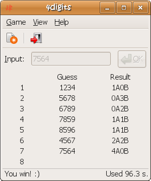

### 开发现状
当新的版本快要发布的时候，大家都忙于加班，加紧修复BUG1、BUG2。我想这就是很多公司开发的现状。
为了不至于让上线的版本挂掉挂掉，少不了就是 `人肉测试`。
在一个项目中，我们会做许许多多各种各样的测试，这些测试都必不可少的。测试是项目成功不可或缺的一部分。但 `人肉测试` 不在本博的讨论范围。

测试大体分为以下几类
> * 单元测试
> * 集成测试
> * 功能测试

### 测试驱动开发
TDD(Test-Driven Development) 从根本上改变了传统的开发模式，它要求你在写代码之前就写好测试，而不仅仅是待你写你代码以后的用作验证的目的。
TDD将测试提到了应用设计的阶段，在这期间你应该用你的测试理清你写代码时的思路，我们称作 `Tasking`.

以下是TDD开发时的基本要点
> 1. Tasking (将项目需要拆分成小的task)
> 2. Red (写测试代码，让其失败，变红)
> 3. Green (写实现代码，让其通过，变绿)
> 4. Refactor (重构，消失代码中的bad smell)
> 5. Repeat (重复以上步骤)

这就是TDD开发过程中的基本过程，我们就在 “红-绿-红-绿” 中完成我们的软件开发。

### JavaScript TDD
笔者将通过编写一个传统游戏的方式，来完成一个 JavaScript TDD 的实践。  

**4 digits**   
是一个猜数字游戏。在国外称为公牛和母牛，在中国人们就叫它猜数字。游戏的目标是在八次内用尽可能短的时间猜出一个随机的四位数：
> * 顺序与大小都相同的用 A 表示  
> * 大小相同，但顺序不同用 B 表示

**比如** 输入 1234 | 猜数 2156 | 结果 0A2B

这是曾经在文曲星上有过的游戏，网友做过一个GUI版的，大家可以看下截图：
   

当然，本文的重点是 JavaScript TDD, 不是去实现一个太过细节逻辑。我们就把需求稍微改写一下：
> * 四位数先给定
> * 仅做算法处理(比较所猜数字与给定数字)

#### 开发准备
> * Node  
> * Mocha

如果不知道 `Node`, 估计你暂时还不用写 `JavaScript`。所以，本篇文章可能还不太适合你。

  
[摩卡](http://visionmedia.github.io/mocha/)是一个功能丰富的运行在 `Node` 和浏览器上的JavaScript测试框架。它允许你使用你任意喜欢的断言库。比如
> * should.js
> * chai
> * expect.js
> * better-assert

本次工程就选择 [should.js](https://github.com/visionmedia/should.js)吧，写TDD很优美，下面正式开发我们的TDD之旅。

#### 工程建立
   
    mkdir -p digits/{src,test}
    cd digits
    touch src/digits.js test/digitsSpec.js
    npm init
    npm install -g mocha
    npm install should --save-dev

工程就是这样搭建完成了，我们可以来看一下目录结构(
我把node_modules目录隐藏了)：

就这样，我们就可以直接运行
    
    mocha 

跑测试了。当然，我们什么代码都没有写，当时没有测试可以跑，所以结果会是一个 `0 passing`。那我们正式开始吧。

#### 测试代码编写
先写出我们的第一个测试用例吧。
如果输入数字，或者所给数字的长度都不等于4，则返回-1。
    
    var should = require('should'),
      Digits = require('../src/digits').Digits;

    describe('Digits', function() {
      // Digits.compare(inputNum, givenNum);
      describe('#compare()', function() {
        it('should return -1 when input and given number length isnt 4', function() {
          Digits.compare('123', '').should.equal(-1);
          Digits.compare('123', null).should.equal(-1);
          Digits.compare('123', '1234').should.equal(-1);
          Digits.compare(null, '1234').should.equal(-1);
        });
      });
    });

嗯，代码看起来不错，我们尝试着 `mocha` 跑一下。啊哦，意料之中，变红了：

什么原因喃？原来我们根本没有写实现代码，你这不废话么？确实是这样，这就是TDD中的第一步，**红**。接下来，我们就编写一些代码，让它变绿吧。

#### 实现代码编写
我们定义一个简单的Digits的function吧，通过 `exports.Digits = Digits;` 将函数接口暴露出去。就像这样：

    function Digits() {}

    Digits.compare = function(inputNum, givenNum) {
      var len = 4;

      if (inputNum === null ||
        givenNum === null ||
        inputNum.length !== len ||
        givenNum.length !== len) {
        return -1;
      }
    }

    exports.Digits = Digits;

看吧，看起来也很不错的样子，那我们继续跑一下测试吧。啊哈，意料之中，变**绿**了：

#### repeat
由红变绿之后，这个task也就相当于是完成了。我们又可以按照这样的一个步骤，再写新的测试，然后再将它实现出来。到此为止，一个基本的 JavaScript TDD流程也就完了，趁着热乎劲儿。我们把这个 `compare` 函数的其他测试也一并写了吧。代码如下：

**digitsSepc.js**

    var should = require('should'),
      Digits = require('../src/digits').Digits;

    describe('Digits', function() {
      // Digits.compare(inputNum, givenNum);
      describe('#compare()', function() {
        it('should return -1 when input and given number length isnt 4', function() {
          Digits.compare('123', '').should.equal(-1);
          Digits.compare('123', null).should.equal(-1);
          Digits.compare('123', '1234').should.equal(-1);
          Digits.compare(null, '1234').should.equal(-1);
        });

        it('should return 4A0B when input numbers matched given numbers', function() {
          Digits.compare('1234', '1234').should.equal('4A0B');
          Digits.compare('5678', '5678').should.equal('4A0B');
        });

        it('should return 2A2B when 2 input numbers matched given numbers, and other 2 exist but not the right order', function() {
          Digits.compare('2134', '1234').should.equal('2A2B');
          Digits.compare('1324', '1234').should.equal('2A2B');
          Digits.compare('3214', '1234').should.equal('2A2B');
          Digits.compare('4231', '1234').should.equal('2A2B');
        });

        it('should return 2A0B when 2 input numbers matched given numbers, and other 2 was wrong numbers', function() {
          Digits.compare('1256', '1234').should.equal('2A0B');
          Digits.compare('7238', '1234').should.equal('2A0B');
          Digits.compare('7834', '1234').should.equal('2A0B');
          Digits.compare('1784', '1234').should.equal('2A0B');
        });
      });
    });

**digits.js**

    function Digits() {}

    Digits.compare = function(inputNum, givenNum) {
      var len = 4,
        aCount = 0,
        bCount = 0;

      if (inputNum === null ||
        givenNum === null ||
        inputNum.length !== len ||
        givenNum.length !== len) {
        return -1;
      }

      if (inputNum === givenNum) {
        return '4A0B';
      }

      for (var i = 0; i < len; i++) {
        if (inputNum[i] === givenNum[i]) {
          aCount++;
        } else if (givenNum.indexOf(inputNum[i]) !== -1) {
          bCount++;
        }
      }

      return aCount + 'A' + bCount + 'B';
    }

    exports.Digits = Digits;

最后再来跑一遍 `mocha -R spec`，结果如下(大功告成啦)：

### 结语
大功告成了，此时的你其实可以洗洗睡了，不用再担心你的程序有问题啦。你的测试告诉你，你的程序都是绿色可行的。当然，如果你测试写有的问题就别当别说咯。
测试代码会有一些什么好处呢？
> * 测试代码在那里，可以保证你以后修改代码时，或者重构时不会对已有的功能产生影响。

这条是很重要的，也是相当重要的。如果没有测试代码的保证，你无从知道你自己所改的代码，对已有的代码会产生什么样的影响。与其每次上线时都得加班改BUG，为啥不先写好测试，上线时早些洗洗睡了呢？
