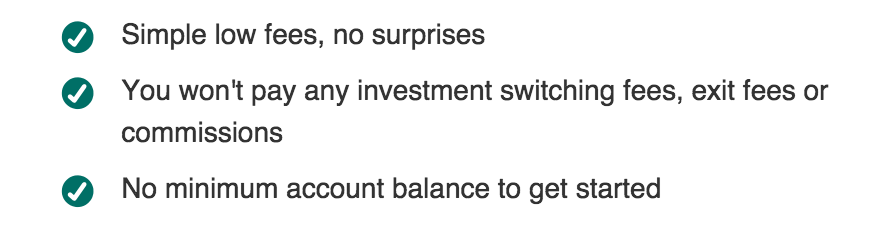
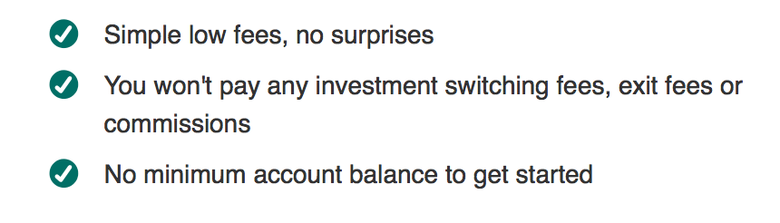

在很多时候，想使用 `display: table;` 以及其子元素使用 `display: table-cell` 都只是为了使用 `vertical-align` 这一属性。这是一个很简单的常识，但这次在项目上使用却产生意想不到的表现方式。

因为我在其中又使用了 `position: relative;` 这样一个属性。同样是一个很简单而标准的属性，我想即使放在一起，肯定也是可以正常工作的。可惜，我错了。

## 缘起
就这样的一个简单的样式场景，

**Chrome**

**FireFox**


看着两个图不一样，很难受是吧？开始的时候，即用的是 `vertical-align: top;` 使用 `position: relative;`去修这样一个位置。因为icon没有 `padding`，而文字却是有 `line-height` 的。直接使用vertical-align: top; 是不够雅观的，必须往下移大概3个px。我就用position: relative; 去调整了一下(当然，使用 `padding-top: 3px;`的话，就没这么多的后话了)。

做为一个开发者，一般说来都会习惯用Chrome或者FF调试自己的样式。而幸运的是，我用的是Chrome，Chrome对很多东西都支持很好，我用了position: relative; 在Chrome调好了样式。这就导致了在Chrome上很好的东西，到其他浏览器的时候会丑得像一堆X一样。到FF上的时候，发现这些位置根本不工作。

## 代码
客户的代码还是就算了，随便写个demo代码吧。
```html
<div class="table">
  <span class="cell">Lorem ipsum dolor sit amet, consectetur adipisicing elit, sed do eiusmod tempor incididunt ut labore et dolore magna aliqua.</span>
  <div class="cell cell-icon"></div>
</div>
```
```css
.table {
  border: 1px solid #ccc;
  display: table;
}
.cell {
  padding: 10px;
  border: 1px solid #ccc;
  display: table-cell;
  vertical-align: top;
}
.cell-icon:before {
  content: "icon";
}
.cell-icon {
  position: relative;
  top: 20px;
}
```
目的只是为了让 `top: 20px;` 工作而已，不用去管它现在是否为业务价值。当然，在客户那里是肯定有价值的。经过测试：

**WORK：**
Chrome |
Safari |
IE 8+

唯FireFox不行，根本不关心你是否有此(position: relative;)属性。
## 过程
遇到这种情况，当然去查找相关资料，最后查到了CSS规范: [choose-position](http://www.w3.org/TR/CSS21/visuren.html#choose-position)。里面有一句:
> The effect of 'position:relative' on table-row-group, table-header-group, table-footer-group, table-row, table-column-group, table-column, table-cell, and table-caption elements is undefined.

大致一意思就是说：`position: relative; `在table-cell或者其他table元素下都是不工作的，醒醒吧少年。

实际的情况是：有些浏览器又允许用户在table-cell里使用绝对或者相对定位(在这里可以看到更多详细信息[http://www.w3.org/TR/CSS21/visuren.html#comp-abspos](http://www.w3.org/TR/CSS21/visuren.html#comp-abspos))。但浏览器又有权不实现那些开发者想要的规范，毕竟这些都不在W3定义的规范里面。

所以，到这里已经明了了，不是由于FF不给力，而确实是由于规范里面没有这样要求，那么剩下的，我们去寻找真正的解决办法就好了。

## 解决
**1.**
以上其实提到过，可以跳过 `position: relative;`，直接就用 `padding-top: 20px;` 就好了。但这明显不能满足我们的好奇心。所以，请看方法二。

**2.**
这需要在table-cell里面在包一层，在这层限定这的position就好了。然后，所有浏览器测试一遍，搞定。
```html
<div class="table">
  <span class="cell">Lorem ipsum dolor sit amet, consectetur adipisicing elit, sed do eiusmod tempor incididunt ut labore et dolore magna aliqua.</span>
  <div class="cell">
    <i class="cell-icon"></i>
  </div>
</div>
```
### [Demo](http://owenyang0.github.io/Snippets/html/table-cell/)

或者有人会觉得简单，我觉得不。这些都只是经验型的东西，如果此前没遇到过，或许你会花很长时间去搞明白到底是怎么一回事。这在所有的事情面前都是一样的。

所以，保持学习，努力填坑。
